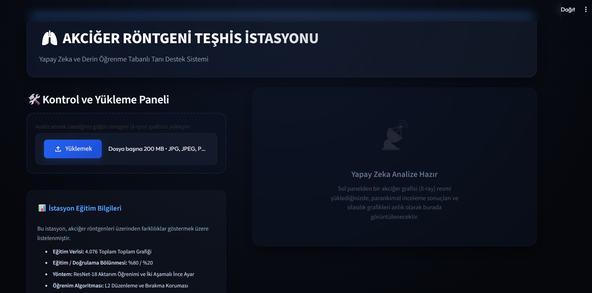
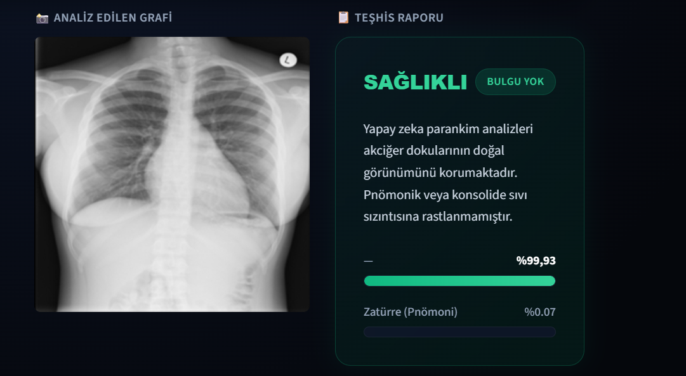
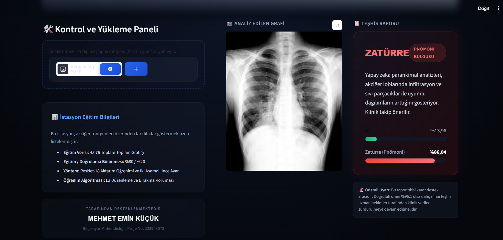

# 🫁 X-Ray Hastalık Tanı Sistemi

Göğüs röntgeni (X-ray) görüntülerini kullanarak **Normal (Sağlıklı)** ve **Zatürre (Pnömoni)** teşhisi yapan derin öğrenme tabanlı yapay zeka sistemi.

> **Öğrenci:** Mehmet Emin Küçük (233908073)  
> **Ders:** Bilgisayar Mühendisliği Tasarım Projesi  
> **Tarih:** Haziran 2026

---

## 📸 Ekran Görüntüleri

| Ana Sayfa | Sağlıklı Sonuç | Zatürre Teşhisi |
|:---------:|:--------------:|:---------------:|
|  |  |  |

---

## 🚀 Projeyi Çalıştırma (Kurulum)

### Gereksinimler
- Python 3.8 veya üzeri
- pip (Python paket yöneticisi)

### Adım 1: Repoyu Klonlayın
```bash
git clone https://github.com/Eminkucuk00/xray-hastalik-tani-sistemi.git
cd xray-hastalik-tani-sistemi
```

### Adım 2: Gerekli Kütüphaneleri Yükleyin
```bash
pip install -r requirements.txt
```

### Adım 3: Uygulamayı Başlatın
```bash
streamlit run app.py
```

Uygulama otomatik olarak tarayıcınızda açılacaktır: `http://localhost:8501`

---

## 🧠 Teknik Detaylar

| Özellik | Detay |
|---------|-------|
| **Model Mimarisi** | ResNet-18 (Transfer Learning) |
| **Eğitim Verisi** | 4,076 göğüs röntgeni görüntüsü |
| **Veri Bölünmesi** | %80 Eğitim / %20 Doğrulama |
| **Doğruluk Oranı** | %96.1 |
| **Eğitim Yöntemi** | İki Aşamalı İnce Ayar (Warm-up + Fine-tuning) |
| **Regularizasyon** | Dropout (0.4 + 0.3) + L2 Weight Decay |
| **Arayüz** | Streamlit (Medikal Karanlık Tema) |

---

## 📂 Proje Yapısı

```
├── app.py                  # Ana Streamlit web uygulaması
├── model.py                # Veri seti bölme scripti
├── model.pth               # Eğitilmiş PyTorch model ağırlıkları
├── train_model.py           # Temel model eğitim scripti
├── train_advanced.py        # Gelişmiş iki aşamalı eğitim scripti
├── extract_and_split.py     # Veri seti ayırma scripti
├── requirements.txt         # Python bağımlılıkları
├── Proje_Raporu.md          # Detaylı proje raporu
├── ss_dashboard.png         # Ekran görüntüsü - Ana sayfa
├── ss_normal.png            # Ekran görüntüsü - Sağlıklı sonuç
├── ss_pneumonia.png         # Ekran görüntüsü - Zatürre teşhisi
└── README.md                # Bu dosya
```

---

## ⚠️ Önemli Notlar

- **Dataset klasörü** boyutu (~1.3 GB) nedeniyle GitHub'a yüklenmemiştir.
- **model.pth** dosyası repo içerisinde mevcuttur, ayrıca indirmenize gerek yoktur.
- Uygulama CPU üzerinde çalışır, GPU gerekli değildir.
- Bu sistem bir tıbbi karar destek aracıdır, nihai teşhis uzman hekimler tarafından konulmalıdır.

---

## 🛠️ Kullanılan Teknolojiler

- **Python** - Ana programlama dili
- **PyTorch & Torchvision** - Derin öğrenme framework'ü
- **Streamlit** - Web arayüzü
- **PIL (Pillow)** - Görüntü işleme
- **Scikit-learn** - Veri bölme ve metrikler
